```{r setup, include=FALSE}
knitr::opts_chunk$set(echo = TRUE)
```

If you use R markdown files in RStudio and have a GitHub account, you are already ready to publish your papers/projects online. You can share the link to your target audience or use the website to showcase what you know. 

When you have your content ready, putting them on the internet takes less than half an hour if you have only one paper, or about one hour if you use the same structure as this website (with minor revision). I assume that you know how to knit your R Markdown file to html and have the files on a repository on your GitHub account. Here is how.  

## Publish one paper

There are three ways to post an article online (so far that I know) using GitHub. 

### First Method - html viewer 

The first method is to use [the html viewer](http://htmlpreview.github.io/). 

For example, I wrote a R Markdown file and knitted into a html file, which were then stored in my repository on GitHub (see graph - html file highlighted in yellow). 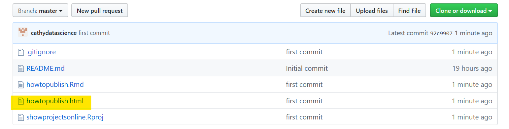   

When I click on it, it has the html format and is not readable. 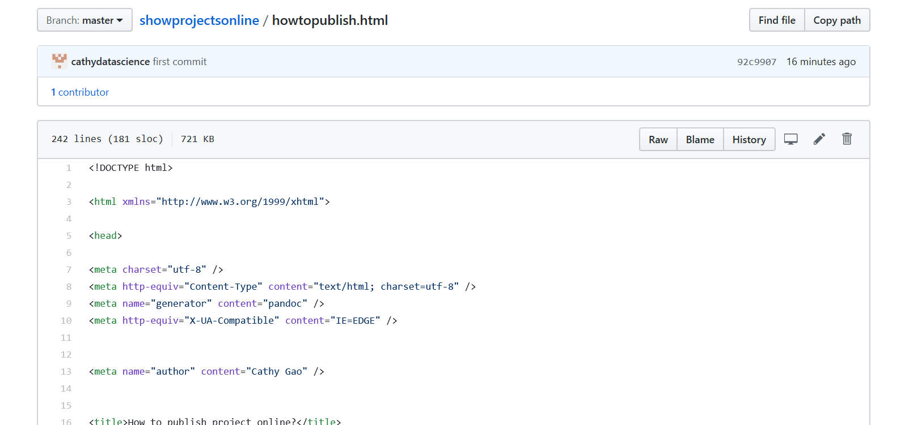

To render it to the html file from a browser that you see on your local computer, you go to the address box on the top of your GitHub page to copy the link 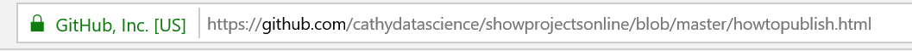 

and then paste it to the [the html viewer](http://htmlpreview.github.io/) 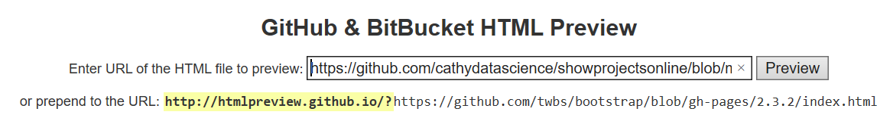. 

Click on the **Preview** button next to the link. It is now live online and you can share the link with others. 

If you find the link too long to remember, you can use the free web service [Bitly](www.bitly.com) to shorten it. Mine is changed to the concise bitly link: http://bit.ly/33lhsF1 from the lengthy URL: http://htmlpreview.github.io/?https://github.com/cathydatascience/showprojectsonline/blob/master/howtopublish.html

### Second method - RPubs

Alternatively, you can use the RPubs which is integrated in your knitted html file from RStudio and is free. After knitting the R Markdown file, you will see the html file on your local computer browser. On the top right corner, click on the triangle next to the **Publish** button. 
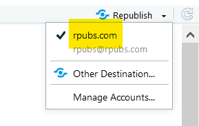 

It is a two-step process. First step, you need to register a RPubs account or sign in if you already have one. You write the title of your document and give a short description (so that other may find your paper from search). You can see the example below (the highlight is my RPubs account name). 
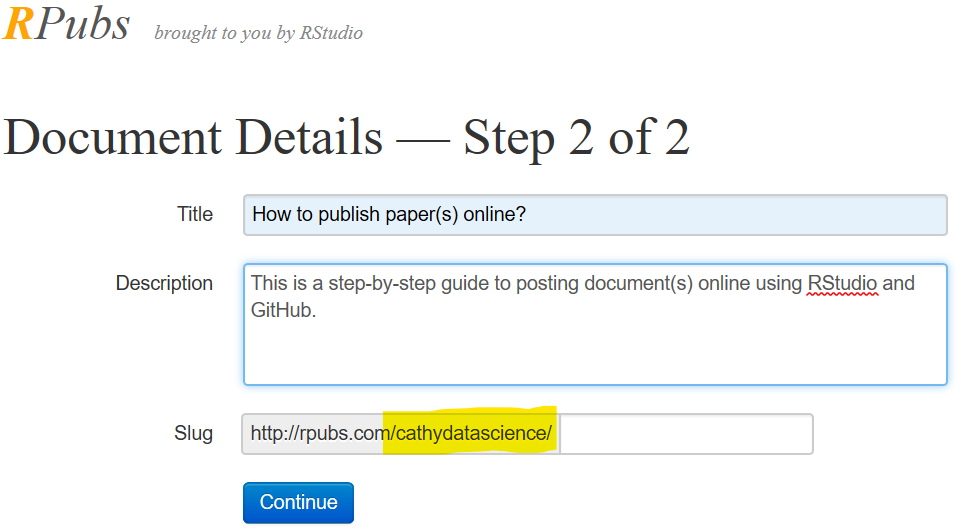

Once you are done and click the **Continue** button at the bottom, you will be directly to the published paper. For example, this paper is available at http://rpubs.com/cathydatascience/518481 

You can choose to update your content when you make changes to the paper on your computer by clicking the **Publish** button from your knitted html file. 

### Third method - GitHub Repo

The third method uses GitHub to post one article from the __master__ branch of a repository. This guide is available at ... Alternatively, you can publish the article from the __master/doc__ branch as well. My project paper is online at ... I will show you how to do it both ways. The former puts all the files under the __master__ branch while the latter puts the R markdown files under the __master__ branch and the html files and additional folders under the __master/doc__ branch. 

RStudio integrates Git commands and links to GitHub (assuming you have Git installed in your computer). You can click through buttons without using the command window (I use GitBash and the list of commands is enclose in the appendix). The advantage of typing in commands is that you can create a copy of your work in a separate branch making sure things work fine before merging the branch with the __master__. However, you can always start from the beginning since there are not many files in the project.  


#### 1. Publish from the __master__ branch on a GitHub repo

You log on to your GitHub account and click the green button **New** to create a new repository. Give a name to your repository and a brief description. Keep the repo to be **Public**. I usually check the box to initialize a README.md file (the content will be same as what you put down on the description box) but it does not matter. In the left pulldown box, type in R and leave the license box on the right alone (or, you can change to your liking). Then, click the green button **Create repository** at the bottom.
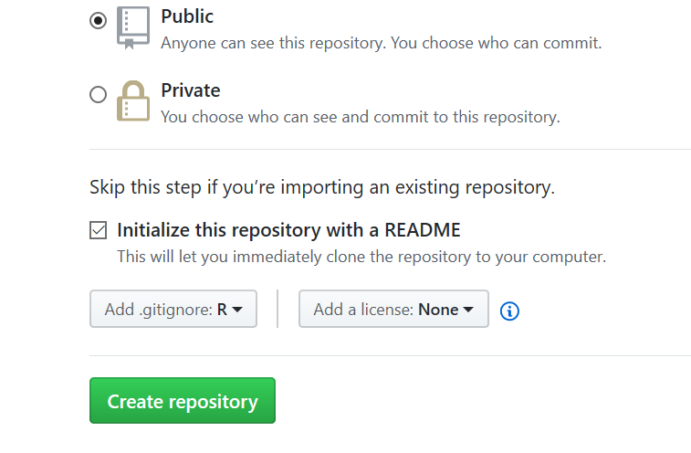

You will be directed to the repo. On the right side of the top, click open the green button **Clone or download** and copy the URL. 
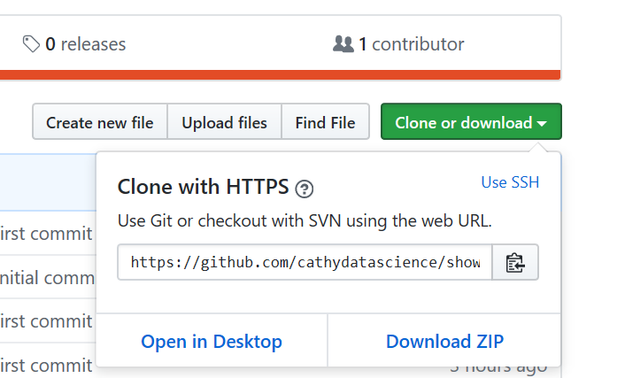

We turn to RStudio now. Under the **File** tab, select **New Project ...**. 
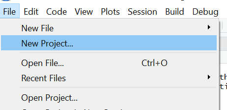

Then, choose **Version Control** and then **Git**. You shall see the following window. 
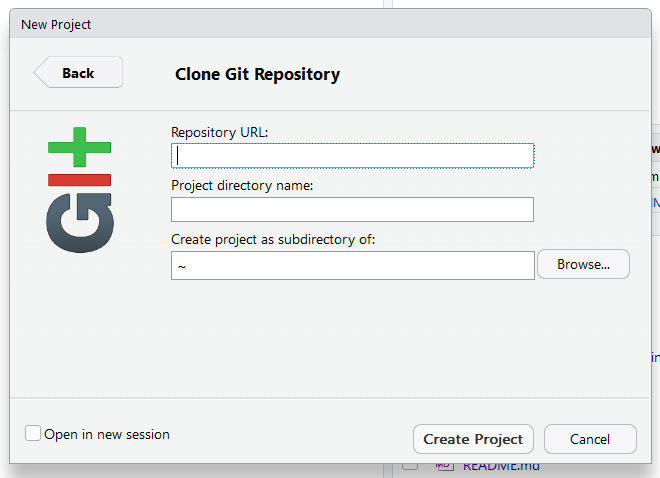
Paste the copied URL from GitHub (which is pointed to your newly created repo). And give a name to your project and you are ready to click **Create Project** to get started. If you want to pick a directory that is different from the working directory, you can change it by clicking **Browse...**. 

When you are done, you shall see the **Git** tab from the top right pane of RStudio. A connection is established between your R project and GitHub. 

You can go ahead and write your R markdown file, or open your previously created R markdown file from other folders (make sure that you save a copy in the project folder) and knitted to html file. You will have two new files on the top right pane under the **Git** tab. For me, there are three since I have an additional folder for the images. 
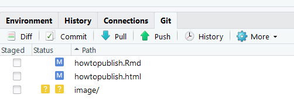


